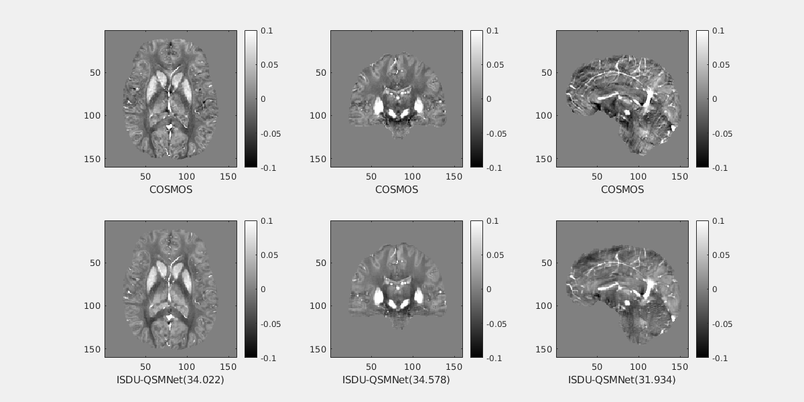

<html>
<head>
</head>
<body>
<h1> ISDU-QSMNet: Iterative Specfic Denoiser via Unshared Weights </h1>
<h2> QSM problem</h2>
QSM provides information about the underlying magnetic susceptibility distribution of a sample from MRI phase measurements. It is useful in the clinical diagnosis of diseases  like Demyelination, Calcification, and Parkinson’s disease.
  
The following mathematical relation represents the linear approximated equation for the QSM reconstruction :

For solving QSM problem, it is required peform dipole deconvolution with local field. It is very cruical step in the QSM solving. Unfortunately, this it is an illposed problem.

<h2>ISDU-QSMNet Architecture</h2>
<h2>Sample QSM reconstruction on QSM-2016 challenge data</h2>  

<h2> How to run the code</h2>
First, ensure that PyTorch 1.10 or higher version is installed and working with GPU. Second, just clone or download this reporsitory. The SpiNet_QSM_demo_run.py file should run without any changes in the code. 

We can run from the command for the training the MSFF-QSMNet: 

**`python MoDL_QSM_USW_RS_ISDU_QSM_train.py --model=MSFF_QSMNet --name=demo1 --saveroot=./savedModels --lr=0.001 --batch-size=8 --epoch=50 --ngpu=2`**.

We can check the quality of the ISDU-QSMNet output by running the **`metrics_evaluation.m`**. It calculates the **`SSIM, pSNR, RMSE, HFEN`**.

<h2>Directories Description</h2>

data
images
qsm_modules
savedModels

MoDL_QSM_SW_test.py
MoDL_QSM_SW_train.py
MoDL_QSM_USW_RS_ISDU_QSM_test.py.py
MoDL_QSM_USW_RS_ISDU_QSM_test_on_QSM_2016_challange_data_RC_1.py
MoDL_QSM_USW_RS_ISDU_QSM_train.py
MoDL_QSM_USW_test.py
MoDL_QSM_USW_train.py
README.md
<h2>Dependencies</h2>
<li> Python  </li>  
<li> PyTorch 2.10 </li>
<li> MATLAB R2022b </li>

