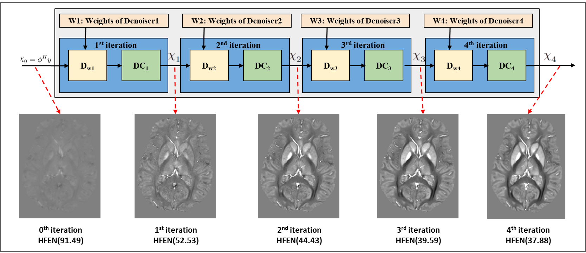

<html>
<head>
</head>
<body>
<h1> ISDU-QSMNet: Iteration Specfic Denoiser via Unshared Weights </h1>
<h2> QSM problem</h2>
QSM provides information about the underlying magnetic susceptibility distribution of a sample from MRI phase measurements. It is useful in the clinical diagnosis of diseases  like Demyelination, Calcification, and Parkinson’s disease.
  
The following mathematical relation represents the linear approximated equation for the QSM reconstruction :

For solving QSM problem, it is required peform dipole deconvolution with local field. It is very cruical step in the QSM solving. Unfortunately, this it is an illposed problem.

<h2>ISDU-QSMNet Architecture</h2>

<h2>Sample QSM reconstruction on QSM-2016 challenge data</h2>  

<h2> How to run the code</h2>
First, ensure that PyTorch 1.10 or higher version is installed and working with GPU. Second, just clone or download this reporsitory. 

We can train the ISDU-QSMNet with the following command: 

**`python MoDL_QSM_USW_RS_ISDU_QSM_train.py `**.

The **`MoDL_QSM_USW_RS_ISDU_QSM_test_on_QSM_2016_challange_data_RC_1.py`** file should run without any changes in the code for testing on RC-1 data. 

We can check the quality of the ISDU-QSMNet output by running the **`metrics_evaluation.m`**. It calculates the **`SSIM, pSNR, RMSE, HFEN`**.

<h2>Directories Description</h2>

**`data:`**  
This directory contains the input data and output results.
**`qsm_modules/qsm_dw_models/** 
This directory contains the different 3D-CNN models for the denoiser. 

**`savedModels:`** 
The directory containes the existing trained models.

<h2>Files Description</h2>

**`qsm_modules/qsm_data_loader/QSM_Dataset_updated.py`** 
This is the data loader code for loading the data.

**`qsm_modules/qsm_loss_modules/loss.py`** 
This is the loss function code which was used in training codes.

**`MoDL_QSM_SW_train.py`** :
training code for a model-based deep learning method using a CNN denoiser-based regularizer with shared weights.

**`MoDL_QSM_SW_test.py`** 
testing code for a model-based deep learning method using a CNN denoiser-based regularizer with shared weights.

**`MoDL_QSM_USW_train.py`** 
a training code for a model-based deep learning method using CNN denoiser-based regularizer with unshared weights (which is incorporating iteration-specific training parameters).

**`MoDL_QSM_USW_test.py`** 
a testing code for a model-based deep learning method using CNN denoiser-based regularizer with unshared weights .

**`MoDL_QSM_USW_RS_ISDU_QSM_train.py`** 
a training code for a model-based deep learning method using CNN denoiser-based regularizer with unshared weights and iteration-specific training parameters, but included random subset sampling during each training epoch to reduce training time.

**`MoDL_QSM_USW_RS_ISDU_QSM_test.py`** 
a testing code for a model-based deep learning method using CNN denoiser-based regularizer with unshared weights and iteration-specific training parameters, but included random subset sampling during each training epoch to reduce training time.

**`MoDL_QSM_USW_RS_ISDU_QSM_test_on_QSM_2016_challange_data_RC_1.py`** 
An exising trained model was using for testing on **RC-1** data.

**`MoDL_QSM_USW_RS_ISDU_QSM_test_on_QSM_2016_challange_data_RC_1`**
It is matlab script for for evaluating the results. This script using **`compute_hfen.m`**, **`compute_psnr.m`**, **`compute_rmse.m`**, **`compute_ssim.m`**, **`compute_xsim.m`** .

<h2>Dependencies</h2>
<li> Python  </li>  
<li> PyTorch 1.10 </li>
<li> MATLAB R2022b </li>

<h2>Contact</h2>
Dr. Phaneendra K. Yalavarthy

Assoc.Prof, CDS, IISc Bangalore, email : yalavarthy@iisc.ac.in

Vaddadi Venkatesh

(PhD) CDS, MIG, IISc Bangalore, email : venkateshvad@iisc.ac.in
